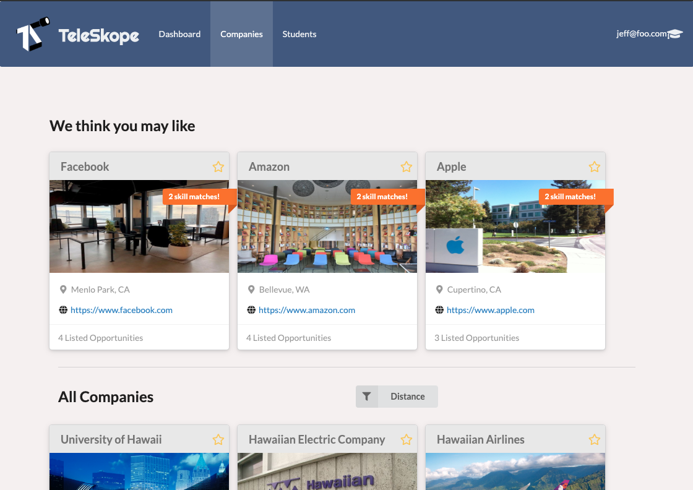
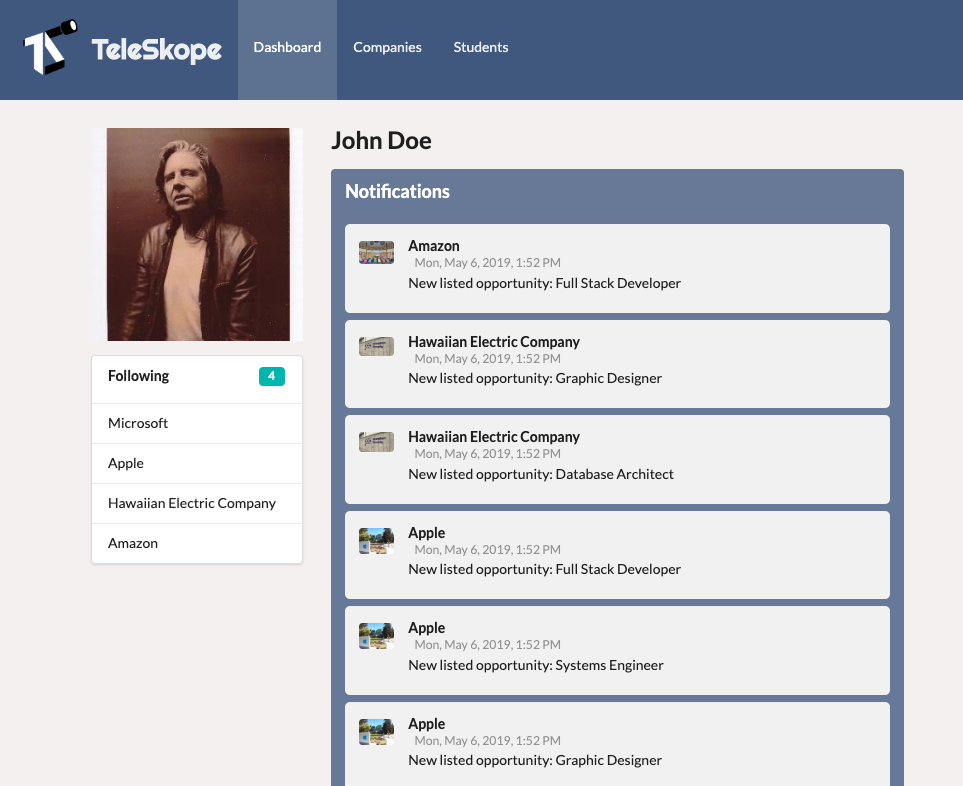

Teleskope is a Meteor Javascript application that uses ReactJS on the front end and is backed by Mongo DB.



## My Contributions

### Subscriptions
User can follow and unfollow a company without having to reload the page thanks to React state and Meteor methods. 
On a follow button I attached a custom handler that calls meteor methods for following and unfollowing a company. Meteor methods are 
Meteor's preferred safe way of making database transactions from the client side. 
```
  handleFollow = () => {
    const companyId = this.props.company._id;
    const followed = this.props.profile.following.includes(companyId);
    if (!followed) {
      Meteor.call('followCompany', companyId);
      this.follow = true;
    } else {
      Meteor.call('unfollowCompany', companyId);
      this.follow = false;
    }
  };
```
The corresponding meteor methods as defined in serverside startup. 
```
Meteor.methods({

  followCompany: function (id) {
    check(id, String);
    const email = Meteor.user().emails[0].address;
    const profile = Profiles.findOne({ owner: email });
    Profiles.update(profile._id, { $push: { following: id } });
  },

  unfollowCompany: function (id) {
    check(id, String);
    const email = Meteor.user().emails[0].address;
    const profile = Profiles.findOne({ owner: email });
    Profiles.update(profile._id, { $pull: { following: id } });
  },
}
```

### Dashboard Notifications
When a user subscribes to a company, they will now receive notifications for that company on the user Dashboard. 

This was accomplished by creating a method for companies to dispatch notifications. `addNotification()` can be called anywhere to push a notification to a company's notifications array.
When a subscribed user goes to their dashboard, all notifications for subscribed companies populate the news feed in chronological order. 
By creating 1 meteor method for adding a notification, I can use it in the database callback functions to create a notification on success. 

Here, the notification is passed as a callback to updating the company's jobs.
```
    Companies.update(company_id, { $push: { jobs: job } }, () => {
      Meteor.call('addNotification', company_id, `New listed opportunity: ${job.title} `);
    });
```


# Top Takeaways
## Code Reviews
Everyone codes differently and the benefit to doing code reviews is to get synchronized. I believe that mandatory pull request reviews allowed us to double check work and learn faster. 


## Creativity within best practices
Javascript is a very flexible language, but while it is possible to create many solutions to one problem, I found it important to always do research for best practice examples. For example, Meteor methods were a best practice for safely making database transactions without hard coding `.insert()` statements into the JSX. It took a little while to get used to how to use them, but once I had it down it made development much faster and easier.

## Mongo DB
My biggest takeaway was learning how to use Mongo DB. It is something I've wanted to use in a project for a long time. I like how collections and documents work and the flexibility it provides allowing you to store data as needed. I find it interesting how forming relationships between data is flexible, and that embedding objects within an object de-normalizes the information, but can speed up read time. With more practice in this area, I think that mongo will be a good tool to have added to my skillset. 


